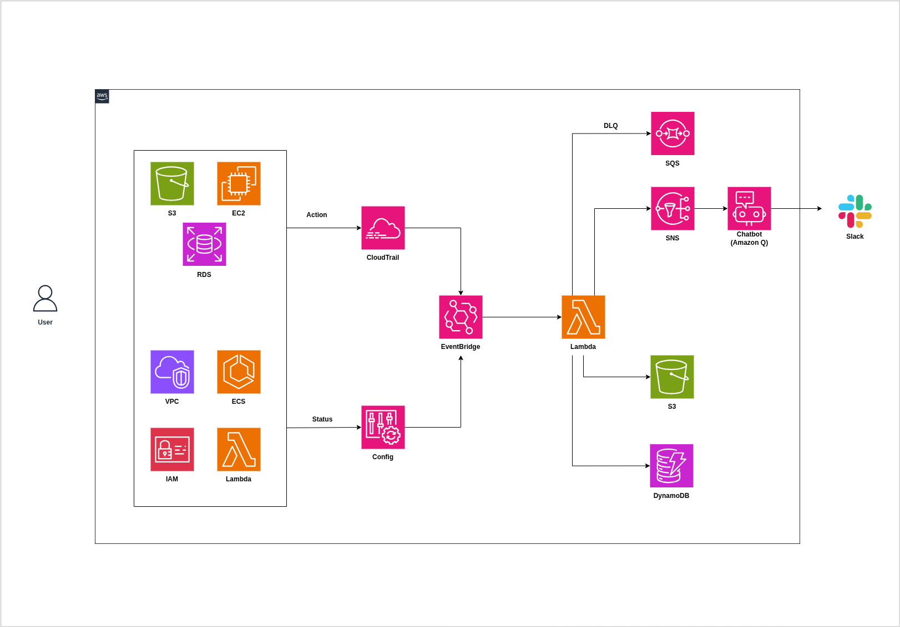

# AWS Resource Event Monitor

[Tiếng Việt](README.vi.md)

## Executive Summary
AWS Resource Event Monitor is a serverless AWS monitoring solution that captures infrastructure events, normalizes event payloads, stores the latest resource state, archives event history, and sends high-severity alerts to Slack.

Primary objective:

- Give operators near-real-time visibility into infrastructure actions and state changes for selected AWS services.

## Architecture Diagram


## Scope (Current)
Monitored service scope for MVP:

- EC2
- S3
- RDS
- Lambda
- IAM
- VPC
- ECS

Event sources:

- CloudTrail (API activity)
- AWS Config (resource configuration/status changes)

## High-Level Architecture

- Ingestion: EventBridge rules receive CloudTrail and Config events.
- Processing: Lambda parses and normalizes events into a common schema.
- Hot state: DynamoDB stores latest state per resource (`pk/sk`, `STATE#LATEST`).
- Cold archive: S3 stores raw and normalized event payloads, partitioned by date.
- Notification: SNS publishes high-severity events; Amazon Q Developer in chat applications delivers to Slack.

## End-to-End Event Flow

1. A monitored AWS service action occurs.
2. CloudTrail/Config emits event data.
3. EventBridge matches and forwards event to Lambda.
4. Lambda:
   - Detects event type.
   - Builds normalized payload (`schema_version: v1`).
   - Writes latest state to DynamoDB.
   - Writes raw + normalized JSON to S3.
   - Calculates severity.
5. If severity is `HIGH` or `CRITICAL`, Lambda publishes SNS.
6. Amazon Q chat integration forwards alert message to Slack.

## Project Status (2026-04-13)

Implemented and validated:

- Core Terraform modules and root composition.
- Lambda processing logic and persistence.
- EventBridge routing.
- SNS + Slack integration path.
- Critical Slack delivery fix using supported custom notification schema.

Remaining work (production readiness):

- DLQ for Lambda.
- CloudWatch alarms (errors, throttles).
- CI/CD pipeline (GitHub Actions with approval flow).
- Unit tests and integration tests.
- Broader E2E scenario pack (minimum 5 critical scenarios).

## Slack Delivery Compatibility Note
Amazon Q chat integration does not accept arbitrary plain-text SNS bodies for this flow.

Required approach:

- Publish supported custom notification JSON schema from Lambda.
- Keep chat integration logging enabled for troubleshooting.

Operational log group:

- `/aws/chatbot/aws-resource-event-monitor-dev-alerts-slack`

Success markers:

- `Successfully processed custom event`
- `Sending message to Slack`

Implementation references:

- Lambda payload format logic: [src/handlers/processor.py](src/handlers/processor.py)
- Slack chat integration config: [infra/main.tf](infra/main.tf)

## Repository Structure

- [infra](infra): Terraform root configuration.
- [infra/modules/dynamodb](infra/modules/dynamodb): DynamoDB module.
- [infra/modules/lambda](infra/modules/lambda): Lambda deployment and IAM.
- [infra/modules/eventbridge](infra/modules/eventbridge): Event bus/rules/targets.
- [infra/modules/notifications](infra/modules/notifications): SNS topic and subscriptions.
- [src/handlers](src/handlers): Lambda application logic.
- [docs](docs): Architecture assets and supporting documentation.

## Prerequisites

- Terraform >= 1.5
- AWS CLI configured for target account/region
- Python 3.12

## Deployment (Dev)
```bash
cd infra
terraform init
terraform fmt -recursive
terraform validate
terraform plan -var-file=dev.tfvars
terraform apply -var-file=dev.tfvars
```

## Key Outputs

- `archive_bucket_name`
- `dynamodb_table_name`
- `dynamodb_table_arn`
- `sns_topic_arn`
- `name_prefix`

## Operations Runbook (Quick Validation)

1. Trigger a real AWS management event (for example, create/delete an S3 bucket).
2. Verify Lambda logs show processing and SNS publish.
3. Verify DynamoDB `STATE#LATEST` is updated.
4. Verify S3 contains new raw and normalized records.
5. Verify Amazon Q log group shows successful processing and Slack dispatch.

## Known Constraints

- Custom EventBridge test events must not use `source` prefix `aws.`.
- Terraform AWS provider naming for chat resources remains `aws_chatbot_*`.
- S3 versioned bucket deletion requires object version cleanup before destroy.

## Destroy (Cost Control)
```bash
cd infra
terraform destroy -var-file=dev.tfvars
```

## Language

- English: [README.md](README.md)
- Vietnamese: [README.vi.md](README.vi.md)